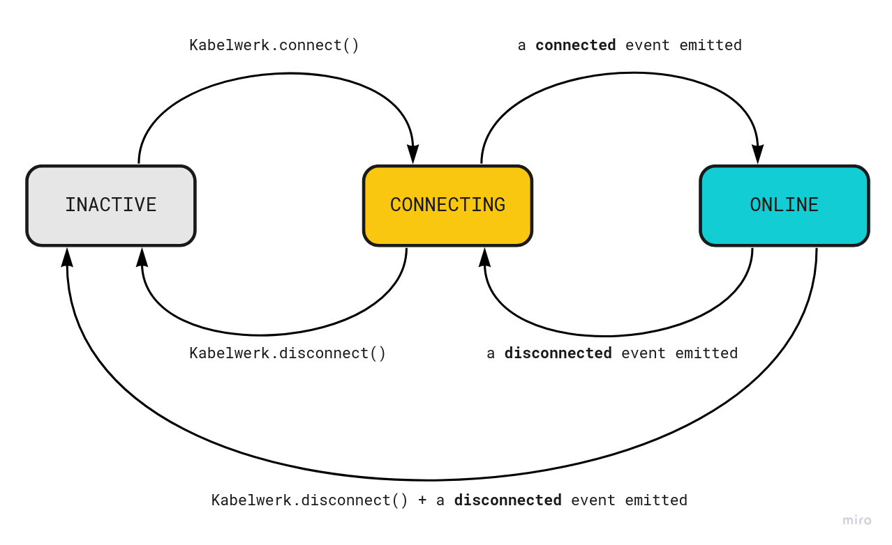

# Connection states

The Kabelwerk object is responsible for opening and maintaining a websocket connection to the Kabelwerk backend. The Kabelwerk object can be in one of the following three states:

-   **`Kabelwerk.INACTIVE`** → There is no connection established to the Kabelwerk backend, nor it is attempted. This is the state before calling [`Kabelwerk.connect()`](./kabelwerk.md#list-of-methods) or after calling [`Kabelwerk.disconnect()`](./kabelwerk.md#list-of-methods).
-   **`Kabelwerk.CONNECTING`** → The Kabelwerk object is actively trying to establish connection to the Kabelwerk backend. This is the state right after calling [`Kabelwerk.connect()`](./kabelwerk.md#list-of-methods) before the connection is established. This is also the state after a connection drop, before it gets re-established.
-   **`Kabelwerk.ONLINE`** → The Kabelwerk object is connected to the backend.

You can at any moment check the current connection state by calling [`Kabelwerk.getState()`](./kabelwerk.md#list-of-methods) — which would always return one of the three constants above.

## See also

-   [The Kabelwerk object](./kabelwerk.md)
-   [Notifiers](./notifiers.md)
